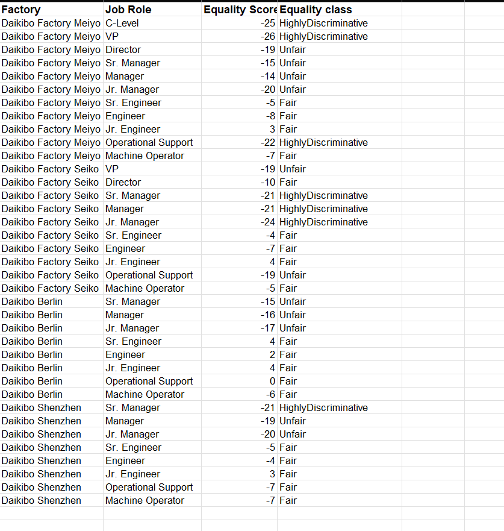

# 📊 Deloitte Data Analytics Virtual Experience

## 📌 Overview

This project is based on the Deloitte Data Analytics Virtual Experience program, where I performed data analysis and visualization to derive business insights.

The project is divided into two main tasks:

* **Task 1:** Data Analysis using Excel
* **Task 2:** Data Visualization using Tableau

---

## 🧰 Tools Used

* Microsoft Excel
* Tableau

---

## 📂 Project Structure

```
/screenshots
/data (optional sample dataset)
README.md
```

---

## 📊 Task 1: Data Analysis (Excel)

### 🔍 Objective

Analyze equality scores across different factories and job roles to identify potential discrimination patterns.

### ⚙️ Work Done

* Cleaned and structured raw data
* Standardized job roles and factory names
* Analyzed equality scores
* Classified data into categories:

  * Fair
  * Unfair
  * Highly Discriminative

### 📸 Output



### 📈 Key Insights

* Certain factories showed **highly negative equality scores**, indicating possible discrimination
* Senior roles (e.g., Manager, Director) often had **lower equality scores**
* Some job roles consistently performed better across locations

---

## 📊 Task 2: Data Visualization (Tableau)

### 🔍 Objective

Analyze operational efficiency by studying downtime across factories and device types.

### ⚙️ Work Done

* Imported and prepared dataset in Tableau
* Created interactive dashboards
* Visualized:

  * Downtime per factory
  * Downtime per device type

### 📸 Dashboard


### 📈 Key Insights

* Certain factories contributed significantly more to downtime
* Specific device types showed **extremely high downtime**, indicating bottlenecks
* Identified areas where operational improvements are needed

---

## 📌 Dataset Note

The original dataset was large and in JSON format.
For simplicity and demonstration purposes, only processed data and results are included in this repository.

---

## 🚀 Conclusion

This project demonstrates:

* Data cleaning and preprocessing
* Analytical thinking
* Data visualization and storytelling

---

## 🔗 Future Improvements

* Add sample dataset in CSV format
* Enhance dashboard interactivity
* Perform deeper statistical analysis

---
